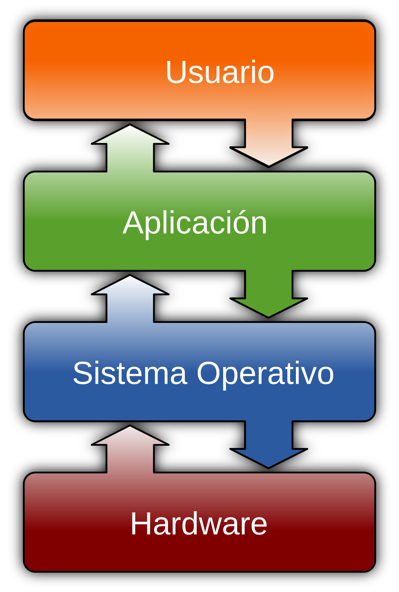
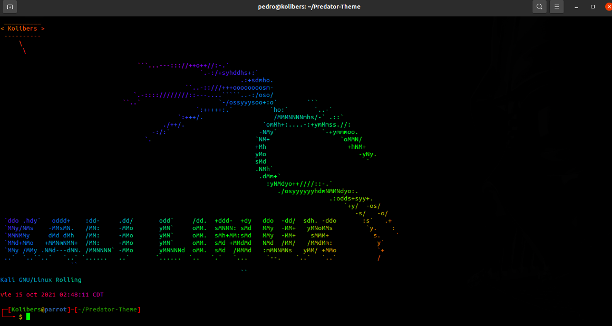
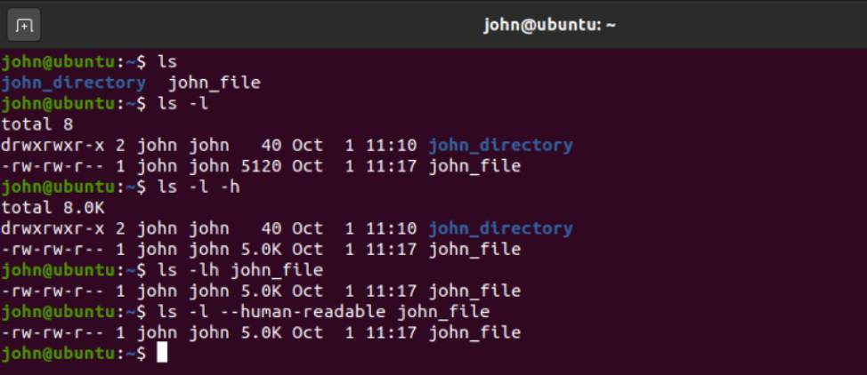
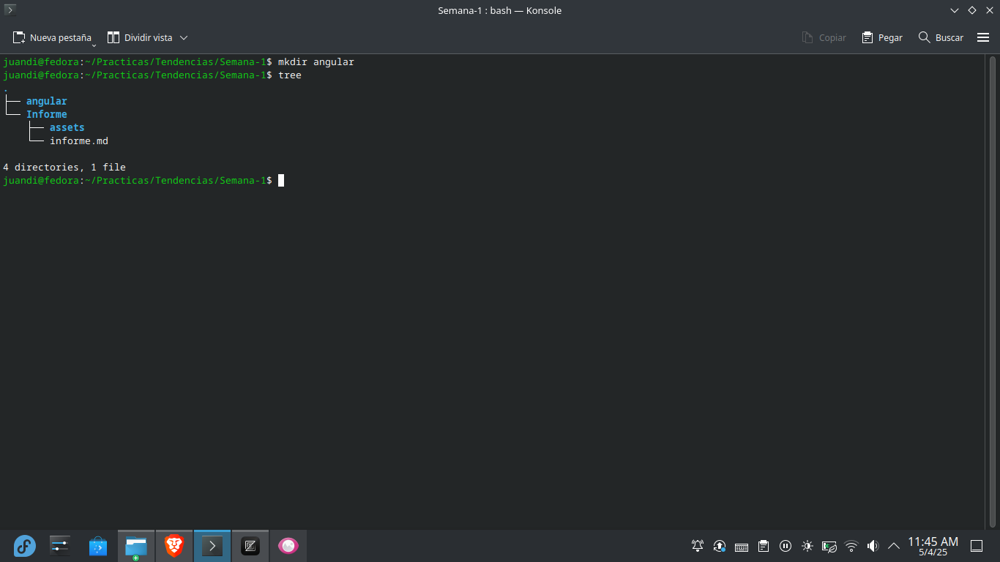
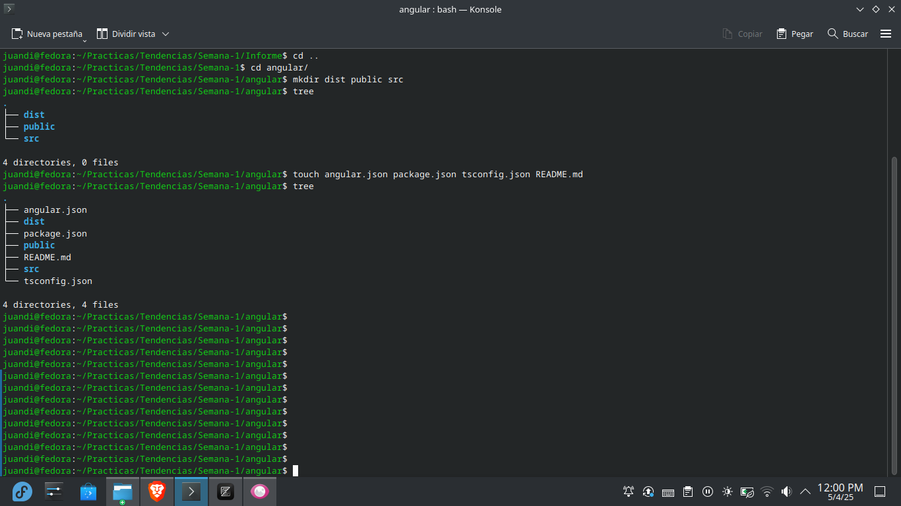
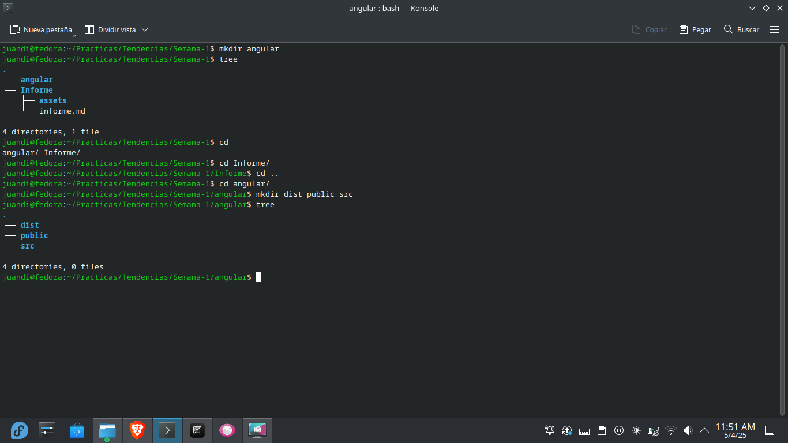
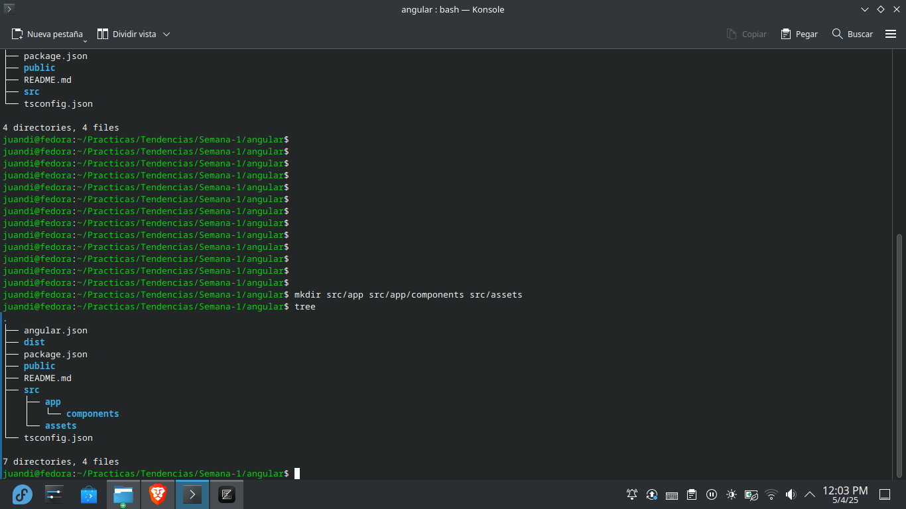
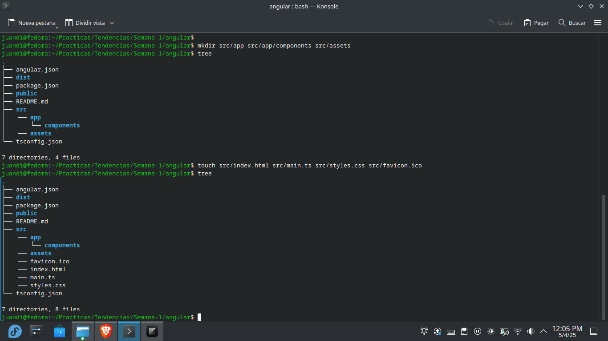
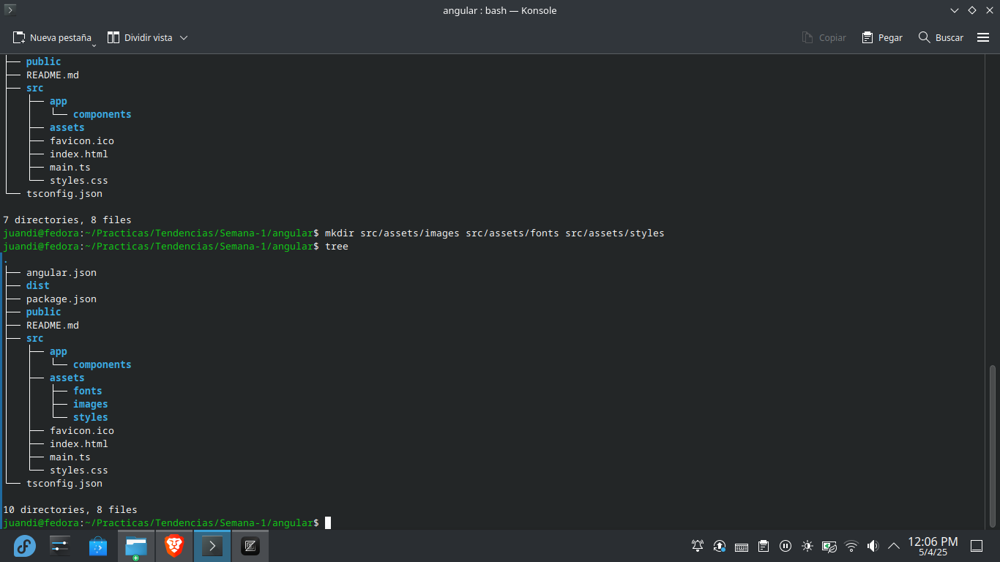
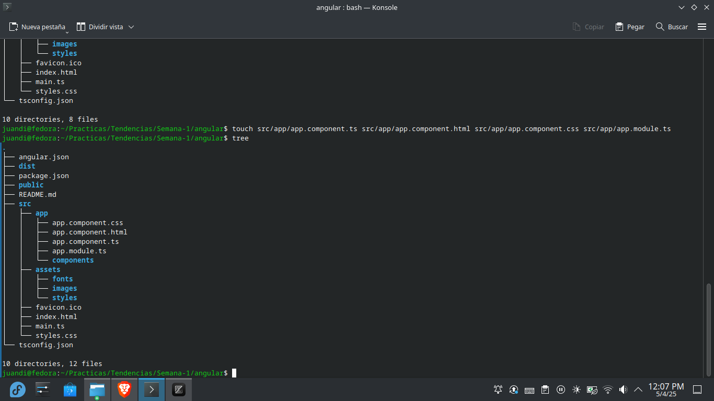

# Práctica Semana 1
## 1. Titulo
Creación de estructura de un proyecto Angular
## 2. Tiempo de duración
1 hora
## 3. Fundamentos:

Para la elaboración de este proyecto, es necesario tener en consideración los siguientes conceptos:

Sistema Operativo: Un SO es un software que gestiona directamente el hardware y los recursos de un sistema, como la CPU, la memoria y el almacenamiento. Se ubica entre las aplicaciones y el hardware y conecta todo el software con los recursos físicos que llevan a cabo el trabajo. (Red Hat, s.f).

  

#### Figura 1-Sistema Operativo

Linux: Linux es un sistema operativo semejante a Unix, de código abierto y desarrollado por una comunidad, para computadoras, servidores, mainframes, dispositivos móviles y dispositivos embebidos. Es compatible con casi todas las principales plataformas informáticas, incluyendo x86, ARM y SPARC, por lo que es uno de los sistemas operativos más soportados. (Bigelow, 2021).

  

#### Figura 2-Sistema Operativo Linux

Terminal de Linux: "La Terminal de Linux es una consola, similar a CMD o PowerShell (pero mucho más avanzada que ambas), utilizada para permitir a los usuarios más avanzados y técnicos controlar hasta el más mínimo detalle del sistema operativo." (Velasco, 2025).

  

#### Figura 3-Terminal de Linux

Comando Linux: Un comando Linux es un programa o utilidad que se ejecuta en la línea de comandos. Una línea de comandos es una interfaz que acepta líneas de texto y las procesa en forma de instrucciones para tu ordenador. Cualquier interfaz gráfica de usuario (GUI) no es más que una abstracción de los programas de línea de comandos. Por ejemplo, cuando cierras una ventana haciendo clic en la «X», hay un comando que se ejecuta detrás de esa acción. (Diaz, s.f).

  

#### Figura 4-Comandos Linux

## 4. Conocimientos previos.

Para realizar esta practica el estudiante necesita tener claro los siguientes temas:

- Comandos Linux

## 5. Objetivos a alcanzar

- Creación de estructura de un proyecto Angular con comandos linux.
- Entendimiento claro sobre la estrucutra de un proyecto Angular.

## 6. Equipo necesario:

- Computador con sistema operativo Windows (Virtual Machine)/ Linux (Nativo)

## 7. Material de apoyo.

- Video explicativo SGA Semana 1

## 8. Procedimiento

Paso 1: Creación de carpeta main en donde se albergará la estructura de nuestro proyecto

  

#### Figura 6-Carpeta Main

Paso 2: Crear archivos de configuración de un proyecto Angular

  

#### Figura 6-Archivos de configuración

Paso 3: Creación de carpetas base de un proyecto Angular

  

#### Figura 7-Carpetas base

Paso 4: Crear subcarpetas dentro de src/

  

#### Figura 8-Subcarpetas en src/

Paso 5: Crear archivos clave de Angular

  

#### Figura 9-Archivos clave en Angular

Paso 6: Organizar recursos en assets

  

#### Figura 10-Recursos en assets/

Paso 7: Crear archivos del componente principal

  

#### Figura 11-Archivos en el main component

## 9. Conclusión:

- Usar Linux puede llegar a ser más complicado que usar Windows, especialmente a la hora de crear, editar, eliminar archivos, carpetas, etc., pero, es necesario el conocimiento en el mundo de la programación.

## 10. Bibliografía

Red Hat. Definición de Linux. (s. f.). Recuperado de: https://www.redhat.com/es/topics/linux/what-is-linux

Bigelow, S. J. (2021). Sistema operativo Linux. ComputerWeekly.es. Recuperado de: https://www.computerweekly.com/es/definicion/Sistema-operativo-Linux

Velasco, R. (s.f). Cómo usar el Terminal de Linux como un profesional. SoftZone. Recuperado de: https://www.softzone.es/linux/tutoriales/terminal-linux/

Diaz, D. (s.f). Los 40 Comandos de Linux Más Utilizados que Debes Conocer. Kinsta.Recuperado de:  https://kinsta.com/es/blog/linux-comandos/
