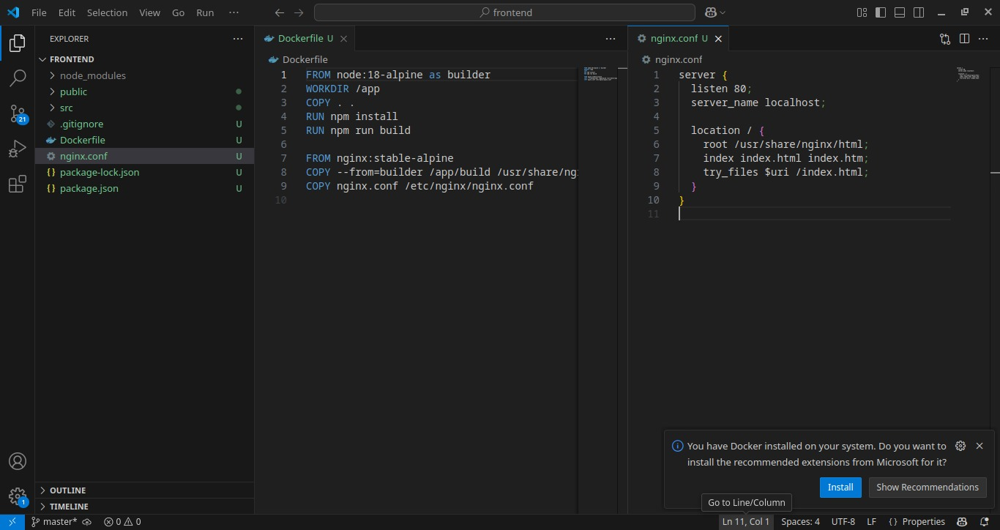
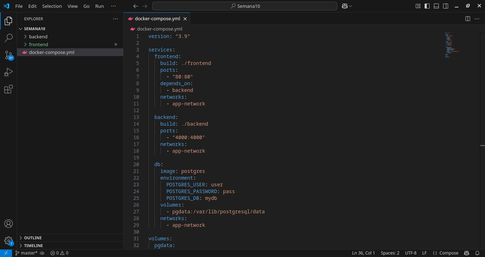

# Práctica Semana 10

## 1. Título

Despliegue de aplicación frontend en modo producción utilizando contenerización con Docker Compose, junto con backend y base de datos.

---

## 2. Tiempo de duración

2 horas

---

## 3. Fundamentos

Docker proporciona una forma estándar de implementar varias aplicaciones en contendedores aislados pero que están conectados en una red en común.  
En esta práctica implementamos:

- Un **backend en Node.js con Express**
- Un **frontend en React**, construido en modo production
- Un **Dockerfile multietapa** para builder de React
- Un **Dockerfile destinado a Nginx**, que sirve archivos estáticos
- Un **Docker Compose** que orquesta backend, base de datos y frontend en contendedores

Este procedimiento proporciona una base consistente para desplegar microservicios en entornos de producción de forma más simple y organizada.

---

## 4. Conocimientos previos

- Docker básico
- Docker Compose
- Node.js, Express
- React
- Nginx como server de archivos estáticos
- Postgres como base de datos

---

## 5. Objetivos

- Construir un contenedor destinado al **build de React con Node.js**
- Construir un contenedor destinado a **servir el build con Nginx**
- Integrar backend, base de datos y frontend en `docker-compose.yaml`

---

## 6. Pasos

### Paso 1 – Crear Dockerfile multietapa para build de React y archivo de configuración nginx

  

#### Figura 1 – Dockerfile destinado a builder de React (compilado en Node) y nginx.conf

---

### Paso 2 – Configurar archivo docker-compose.yml

  

#### Figura 2 – Configuración archivo docker-compose.yml

---

### Paso 3 – Mostrar resultados en el frontend

  

#### Figura 3 – Resultados frontend

---

## 7. Conclusiones

Esta práctica evidencia cómo podemos implementar una aplicación multicontener en Docker de forma profesional.  
Usamos **Docker Compose** para orquestar:

- Un backend en Node.js
- Una base de datos Postgres
- Un frontend en React, construido en multietapa y servido con Nginx

Este procedimiento proporciona una aplicación más ligera, más organizada y más fácil de desplegar en entornos de producción, evitando tener que gestionar cada contenedor de forma independiente.

---

## 8. Bibliografía

Docker. (2024). Docker Documentation. https://docs.docker.com/
Docker Compose. (2024). Docker Compose Overview. https://docs.docker.com/compose/
Nginx. (2024). Nginx Documentation. https://www.nginx.com/
React. (2024). React. https://react.dev/