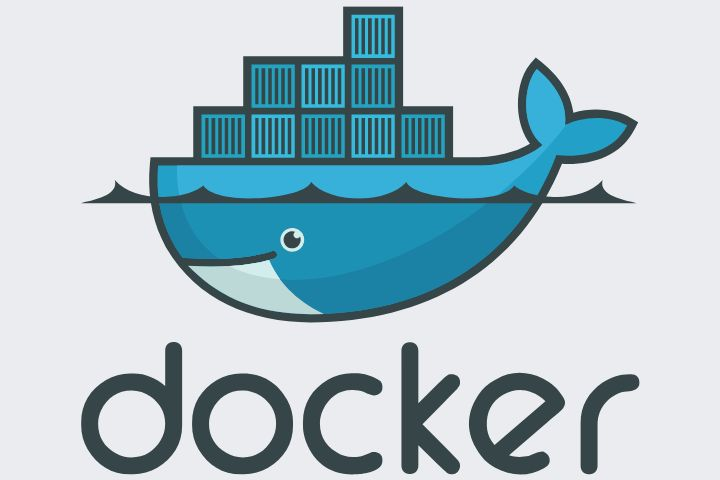

# Práctica Semana 2
## 1. Titulo
Creación de dos servidores nginx con la utilización de Docker
## 2. Tiempo de duración
2 hora
## 3. Fundamentos:

Para la elaboración de este proyecto, es necesario tener en consideración los siguientes conceptos:

Docker: Docker es una plataforma de software que le permite crear, probar e implementar aplicaciones rápidamente. Docker empaqueta software en unidades estandarizadas llamadas contenedores que incluyen todo lo necesario para que el software se ejecute, incluidas bibliotecas, herramientas de sistema, código y versión ejecutable. Con Docker, puede implementar y ajustar la escala de aplicaciones rápidamente en cualquier entorno con la certeza de saber que su código se ejecutará. (AWS, s.f.).

  

#### Figura 1-Docker

nginx: Nginx, pronunciado como “engine-ex”, es un servidor web de código abierto que, desde su éxito inicial como servidor web, ahora también es usado como proxy inverso, cache de HTTP, y balanceador de carga. (Kinsta, 2025).

  

#### Figura 2-nginx

Despliegue de apps web: El despliegue de aplicaciones web es la acción que se conoce como presentar o hacer pública por primera vez una aplicación o página web a través de determinadas herramientas. Este término proviene del inglés con la palabra “deploy”. 

Este procedimiento se realiza debido a que no tiene mucha lógica que todo el trabajo de desarrollar una aplicación web sea para el uso de una única persona. Por esta razón, todos los archivos desarrollados y las configuraciones programadas se comparten para que cualquier usuario pueda aprovecharlas. En otras palabras, es crucial poner todo el trabajo del desarrollador en uso en una máquina diferente para permitir que cualquier persona tenga acceso a la aplicación a través de una URL. (ESIC, s.f.).

  

#### Figura 3-Despliegue de apps web

## 4. Conocimientos previos.

Para realizar esta practica el estudiante necesita tener claro los siguientes temas:

- Comandos básicos de Linux
- Comandos básicos de Docker

## 5. Objetivos a alcanzar

- Despliegue de dos servidores web basados en la imagen de Nginx.
- Edición de archivos usando vin o nano.

## 6. Equipo necesario:

- Computador con sistema operativo Windows (Virtual Machine)/ Linux (Nativo)

## 7. Material de apoyo.

- Videos explicativos SGA Semana 2

## 8. Procedimiento

Paso 1: Instalación de Docker mediante comandos linux

  

#### Figura 4-Instalación de Docker

Paso 2: Crear dos contenedores mediante comandos de Docker exponiendo dos diferentes puertos.

  

#### Figura 5-Creación de contenedores Docker

Paso 3: Copiar el archivo index.html desde el contenedor nginx1 al sistema anfitrión

  

#### Figura 6-Copiar archivo index.html nginx 1

Paso 4: Editar archivo mediante comando "nano" e insertar información Institucional.

  

#### Figura 7-Edición archivo html

Paso 5: Reiniciar contenedor con "docker restart nginx1" y mostrar resultado en el navegador 

  

#### Figura 8-Resulado contenedor 1

Paso 6: Copiar el archivo html del contenedor nginx 2.

  

#### Figura 10-Copiar archivo index.html nginx 2

Paso 7: Editar archivo html con información personal usando "nano".

  

#### Figura 10-Edición archivo index.html nginx 2

Paso 8: Reiniciar contenedor con "docker restart nginx2" y mostrar en el navegador.

  

#### Figura 11-Resultado contenedor 2

## 9. Conclusión:

- La utilización de Docker es muy útil al momento de crear apps de forma individual o independiente (contenedores), haciendo que esea viable en cualquier etapa de desarrollo de una app, desde el proceso de desarrollo hasta producción.

## 10. Bibliografía

AWS. (s. f.). Contenedores de Docker | ¿Qué es Docker? |. Amazon Web Services, Inc. Recuperado de: https://aws.amazon.com/es/docker/

Kinsta. (2025). ¿Qué Es NGINX y Cómo Funciona? NGINX explicado para principiantes. Kinsta. Recuperado de: https://kinsta.com/es/base-de-conocimiento/que-es-nginx/

ESIC (s. f.). Despliegue de aplicaciones web: en qué consiste. ESIC. Recuperado de: https://www.esic.edu/rethink/tecnologia/despliegue-aplicaciones-web-c#:~:text=El%20despliegue%20de%20aplicaciones%20web,con%20la%20palabra%20%E2%80%9Cdeploy%E2%80%9D.