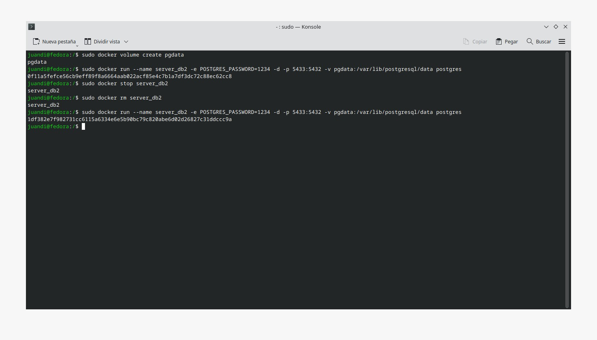

# Práctica Semana 3
## 1. Titulo
Persistencia de Datos con Docker y PostgreSQL usando Volúmenes
## 2. Tiempo de duración
2 horas
## 3. Fundamentos:

El uso de contenedores ha transformado la forma en que se gestionan y despliegan aplicaciones, especialmente por su capacidad de crear entornos ligeros, aislados y reproducibles. Docker, como tecnología de contenedores, permite empaquetar una aplicación junto con sus dependencias, evitando así problemas de compatibilidad entre entornos de desarrollo y producción (Merkel, 2014).

No obstante, los contenedores por defecto no conservan los datos una vez que se detienen o eliminan. Esta característica representa una limitación importante cuando se trabaja con bases de datos o aplicaciones que requieren conservar su estado. Para solucionar esto, Docker ofrece el concepto de volúmenes persistentes, que permiten mantener los datos fuera del ciclo de vida del contenedor, asegurando su disponibilidad incluso después de reiniciar o eliminar dicho contenedor (Boettiger, 2015).

En el caso de PostgreSQL, una base de datos relacional ampliamente utilizada, el uso de volúmenes es fundamental para garantizar que la información almacenada no se pierda con cada reinicio del contenedor. Los volúmenes se pueden montar desde el host o gestionarse mediante Docker, lo que brinda flexibilidad y control sobre el almacenamiento (PostgreSQL Global Development Group, 2023).

  

#### Figura 1-PostgreSQL

Este tipo de prácticas se vuelve aún más relevante en contextos donde se requiere estabilidad y consistencia de los datos, como en entornos de producción, pruebas automatizadas o despliegues continuos. Además, su implementación ayuda a mantener una separación clara entre el entorno de ejecución y los datos generados por la aplicación, mejorando así la mantenibilidad y la escalabilidad del sistema (Turnbull, 2014).

  

#### Figura 2-Funcionamiento de un volumen en Docker

## 4. Conocimientos previos.

Para realizar esta practica el estudiante necesita tener claro los siguientes temas:

- Conocimientos básicos de comandos de terminal en Linux.
- Familiaridad con el uso de Docker y contenedores.
- Conceptos básicos de bases de datos relacionales y PostgreSQL.
- Uso de herramientas de clientes de bases de datos como DataGrip o TablePlus.

## 5. Objetivos a alcanzar

- Implementar contenedores PostgreSQL con y sin volúmenes.
- Evaluar la diferencia en la persistencia de los datos al utilizar volúmenes.
- Conectar un cliente externo (DataGrip o TablePlus) a un contenedor Docker de PostgreSQL.
- Verificar cómo la persistencia de datos funciona en ambos escenarios.

## 6. Equipo necesario:

- Computador con sistema operativo Windows (Virtual Machine)/ Linux (Nativo)
- Docker instalado (versión 24 o superior).
- Cliente PostgreSQL: DataGrip o TablePlus.

## 7. Material de apoyo.

- Videos explicativos SGA Semana 3
- Documentación oficial de Docker
- Documentación oficial de PostgreSQL

## 8. Procedimiento

### Parte 1

Paso 1: Crear el contenedor sin volumen

  

#### Figura 3-Contenedor sin volumen

Paso 2: Conectar desde TablePlus o DataGrip

  

#### Figura 4-Conección DataGrip

Paso 3: Crear la base de datos test

  

#### Figura 5-Creación base de datos "test"

Paso 4: Crear la tabla customer

  

#### Figura 6-Creación tabla customer

Paso 5: Insertar datos en la tabla "customer"

  

#### Figura 7-Inserción de datos en tabla "customer"

Paso 6: Detener el contenedor

  

#### Figura 8-Detener contenedor

Paso 7: Eliminar el contenedor

  

#### Figura 9-Eliminar contenedor

Paso 8: Verificar que los datos se hayan eliminado completamente

  

#### Figura 10-Verificación de la pérdida de datos

### Parte 2

Paso 1: Crear el volumen "pgdata"

  

#### Figura 10-Creación de volumen 

Paso 2: Crear contenedor con volumen

  

#### Figura 11-Crear contenedor con volumen

Paso 3: Conectar desde TablePlus o DataGrip

  

#### Figura 12-Conexión con DataGrip

Paso 4: Crear base de datos test

  

#### Figura 13-Creación base de datos test

Paso 5: Crear la tabla customer

  

#### Figura 14-Creación tabla customer

Paso 6: Inserción de datos dentro de la tabla customer

  

#### Figura 15-Inserción de datos tabla customer

Paso 7: Detener el contenedor

  

#### Figura 16-Detención de contenedor

Paso 8: Eliminar el contenedor

  

#### Figura 17-Eliminación de contenedor

Paso 9: Crear contenedor nuevamente con volumen

  

#### Figura 18-Re-creación de contenedor

Paso 10: Conectar nuevamente en DataGrip

  

#### Figura 19-Conexión DataGrip

Paso 11: Verificar la persistencia de datos

  

#### Figura 20-Verificación persistencia de datos

## 9. Conclusión:

- El uso de volúmenes persistentes en Docker permite conservar datos importantes, incluso si el contenedor se reinicia o elimina. Esta práctica es clave al trabajar con bases de datos como PostgreSQL, ya que mejora la estabilidad y facilita tareas como respaldo y migración. Además, ayuda a mantener una arquitectura más limpia y escalable, lo que resulta esencial en proyectos de desarrollo profesional.

## 10. Bibliografía

Boettiger, C. (2015). An introduction to Docker for reproducible research. ACM SIGOPS Operating Systems Review, 49(1), 71–79. Recuperado de> https://doi.org/10.1145/2723872.2723882

Merkel, D. (2014). Docker: Lightweight Linux containers for consistent development and deployment. Linux Journal, 2014(239), 2.

PostgreSQL Global Development Group. (2023). PostgreSQL Documentation. Recuperado de> https://www.postgresql.org/docs/

Turnbull, J. (2014). The Docker Book: Containerization is the new virtualization. James Turnbull.