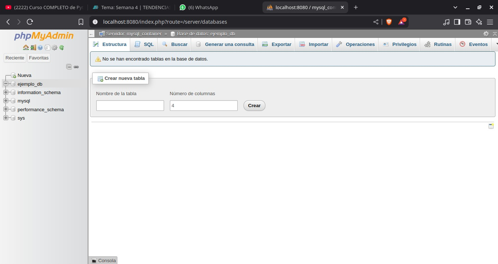

# Práctica Semana 4
## 1. Titulo
Implementación de un Servidor Web con Contenedores Docker para MySQL y phpMyAdmin en Red Personalizada
## 2. Tiempo de duración
2 horas
## 3. Fundamentos:

"En la actualidad, la virtualización de servicios mediante contenedores es una práctica ampliamente adoptada tanto en el desarrollo como en la administración de sistemas. Docker es una de las herramientas más utilizadas para este fin. Esta tecnología permite empaquetar aplicaciones y sus dependencias en contenedores ligeros, aislados y portables, lo que garantiza que funcionen de manera uniforme en diferentes entornos" (Docker, 2024).

"Uno de los beneficios clave de Docker es la facilidad con la que se pueden desplegar servicios interrelacionados en contenedores separados. Por ejemplo, se puede tener un contenedor que aloje una base de datos MySQL y otro que ejecute phpMyAdmin, una interfaz gráfica basada en la web para la administración de bases de datos. Esta separación de servicios permite un mejor control, mantenimiento y escalabilidad del sistema" (Fernández, 2022).

  

#### Figura 1-Comunicación entre contenedores

"MySQL es un sistema de gestión de bases de datos relacional que permite almacenar y consultar grandes volúmenes de información de manera estructurada. Su integración con phpMyAdmin resulta útil en entornos educativos y de desarrollo debido a su facilidad de uso. phpMyAdmin permite realizar operaciones como la creación de tablas, inserción de datos o ejecución de consultas SQL sin necesidad de usar la línea de comandos" (phpMyAdmin, 2024).

"Por otro lado, Docker permite crear redes virtuales internas donde los contenedores pueden comunicarse entre sí utilizando nombres asignados, en lugar de direcciones IP. Esto no solo facilita la configuración, sino que también mejora la seguridad al mantener los servicios aislados del exterior salvo que se especifique lo contrario" (Martínez, 2021).

  

#### Figura 2-Funcionamiento de redes virtuales en Docker

## 4. Conocimientos previos.

Para realizar esta practica el estudiante necesita tener claro los siguientes temas:

-Comandos Linux básicos
-Uso de terminal
-Conceptos de base de datos relacionales
-Fundamentos de Docker

## 5. Objetivos a alcanzar

-Implementar contenedores para MySQL y phpMyAdmin
-Configurar una red personalizada en Docker
-Establecer conexión entre contenedores
-Crear y administrar bases de datos desde phpMyAdmin

## 6. Equipo necesario:

- Computador con sistema operativo Windows (Virtual Machine) ó Linux (Nativo)
- Docker instalado 
- Conexión a Internet

## 7. Material de apoyo.

- Videos explicativos SGA Semana 4
- Documentación oficial de Docker

## 8. Procedimiento

### Parte 1

Paso 1: Crear una red personalizada

  

#### Figura 3-Creación red personalizada

Paso 2: Crear contenedor de MySQL

  

#### Figura 4-Creación de contenedor MySQL

Paso 3: Crear contenedor de phpMyAdmin

  

#### Figura 5-Creación de contenedor en phpMyAdmin

Paso 4: Iniciar sesión en phpMyAdmin desde http://localhost:8080 y crear base de datos

  

#### Figura 5-login y creación de base de datos

## 9. Conclusión:

- La práctica permitió comprender cómo implementar y conectar contenedores en Docker, configurando correctamente MySQL y phpMyAdmin en una red personalizada. A través de este ejercicio, se reforzaron conceptos clave sobre despliegue de servicios independientes y administración de bases de datos, habilidades esenciales para entornos de desarrollo y producción.

## 10. Bibliografía

Docker. (2024). Qué es Docker. Recuperado de https://www.docker.com/resources/what-container

phpMyAdmin. (2024). Documentación oficial. Recuperado de https://docs.phpmyadmin.net/es/latest/

Fernández, A. (2022). Docker para principiantes. OpenWebinars. Recuperado de: https://openwebinars.net/blog/curso-docker-principiantes/

Martínez, L. (2021). Introducción a Docker y contenedores. Recuperado de https://desarrolloweb.com/articulos/introduccion-docker-contenedores.html