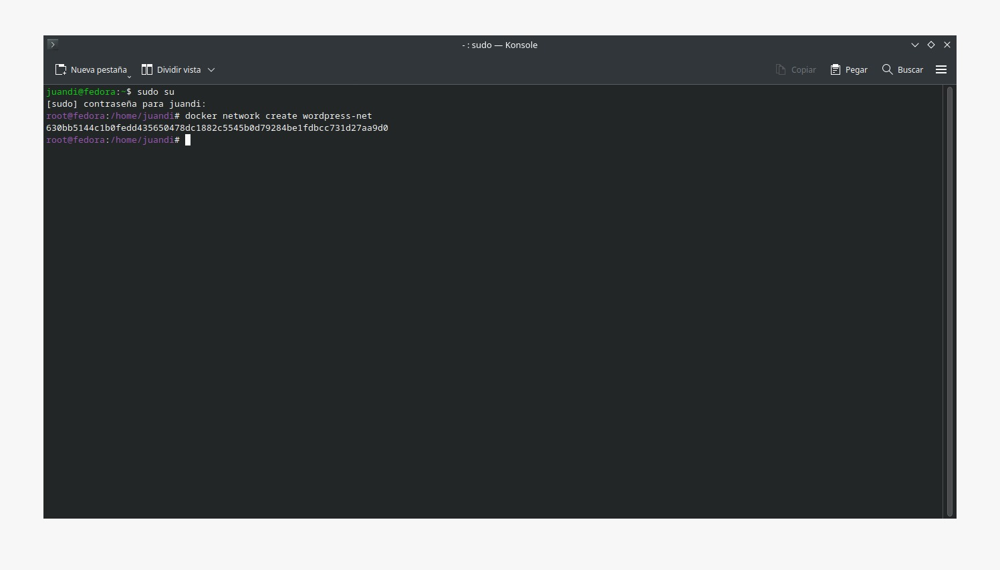
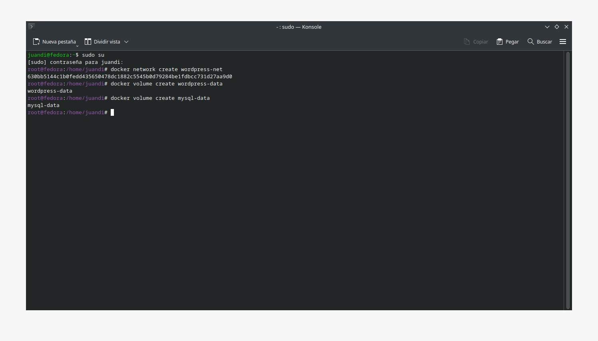
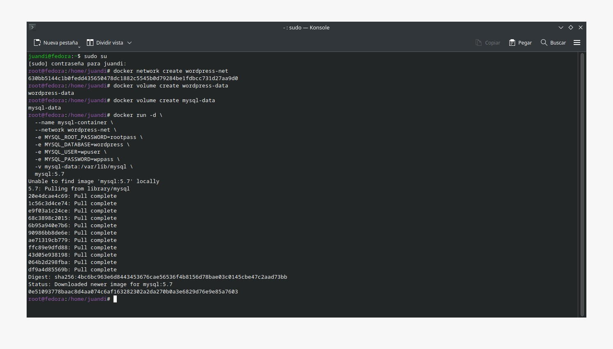
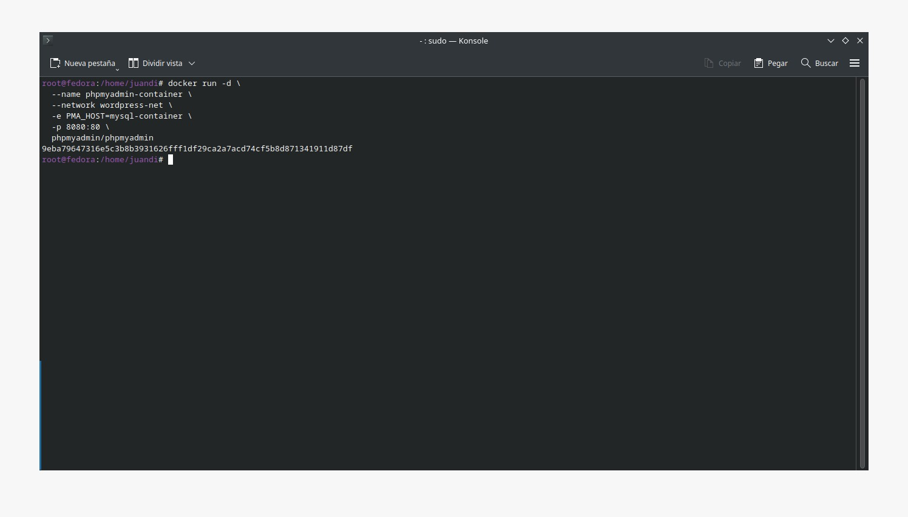
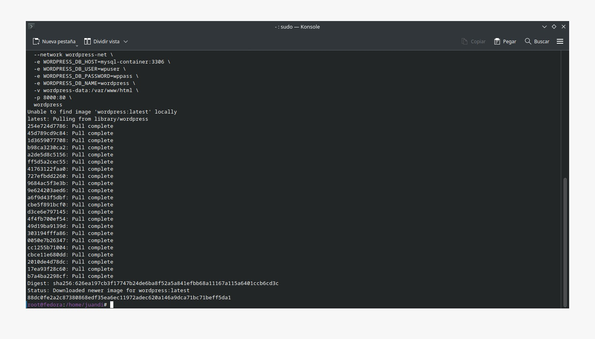
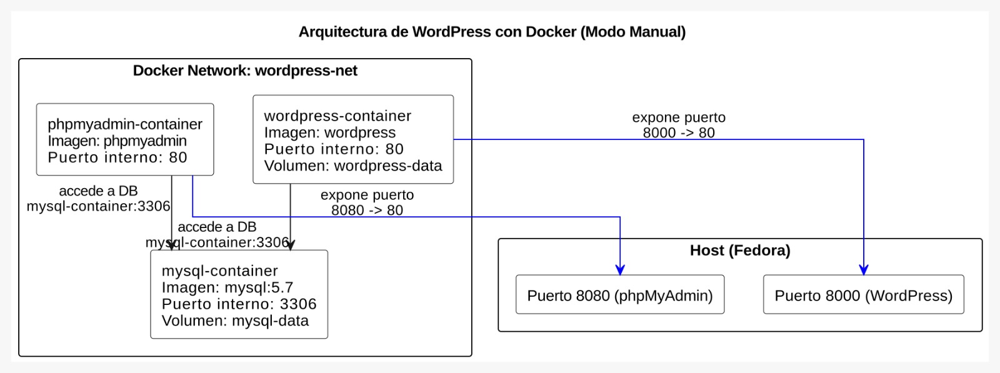

# Práctica Semana 5
## 1. Titulo
Implementación de un CMS WordPress con Contenedores Docker, Redes Personalizadas y Persistencia de Datos
## 2. Tiempo de duración
2 horas
## 3. Fundamentos:

Hoy en día, el despliegue de aplicaciones web se ve beneficiado por herramientas de contenedorización como Docker, que permiten empaquetar aplicaciones junto con sus dependencias en entornos aislados, portables y reproducibles. En este contexto, WordPress es uno de los gestores de contenido (CMS) más utilizados a nivel mundial y su instalación clásica puede automatizarse y simplificarse mediante Docker.

En esta práctica se crearon manualmente contenedores para levantar un sitio WordPress funcional, junto a una base de datos MySQL y una interfaz de administración con phpMyAdmin. Cada contenedor cumple un rol específico, facilitando la separación de responsabilidades, escalabilidad y mantenimiento.

Un aspecto clave es la implementación de una red personalizada mediante docker network create, que permite una comunicación segura entre los contenedores, usando nombres en lugar de direcciones IP.

Otro componente esencial fueron los volúmenes persistentes, creados con docker volume create, para garantizar que los datos de WordPress y la base de datos no se pierdan al eliminar o reiniciar los contenedores.

Finalmente, se configuraron variables de entorno durante la creación de los contenedores, permitiendo definir parámetros esenciales como nombre de la base de datos, usuario y contraseña, sin necesidad de modificar archivos de configuración manualmente.

  

#### Figura 1 - Diagrama de arquitectura de contenedores con Docker.

## 4. Conocimientos previos.

Para realizar esta practica el estudiante necesita tener claro los siguientes temas:

-Comandos Linux básicos
-Uso de terminal
-Conceptos de base de datos relacionales
-Fundamentos de Docker

## 5. Objetivos a alcanzar

- Implementar contenedores para WordPress, MySQL y phpMyAdmin
- Configurar una red personalizada en Docker
- Establecer conexión entre contenedores usando nombres
- Establecer variables de entorno en la creación de contenedores
- Crear volúmenes para persistencia de datos

## 6. Equipo necesario:

- Computador con sistema operativo Windows (Virtual Machine) ó Linux (Nativo)
- Docker instalado 
- Conexión a Internet

## 7. Material de apoyo.

- Diagrama explicativo (SGA Semana 5)
- Documentación oficial de Docker

## 8. Procedimiento

Paso 1: Crear red personalizada

  

#### Figura 2-Creación red personalizada

Paso 2: Crear volúmenes

  

#### Figura 3-Creación de volúmenes a utilizar

Paso 3: Crear contenedor de MySQL

  

#### Figura 4-Creación de contenedor MySQL

Paso 4: Crear contenedor de phpMyAdmin

  

#### Figura 5-Creación de contenedor phpMyAdmin

Paso 5: Crear contenedor de WordPress

  

#### Figura 5-Creación de contenedor WordPress

Paso 6: Elaborar diagrama explicativo con los puertos expuestos en cada contenedor

  

#### Figura 6-Diagrama Explicativo

## 9. Conclusión:

- La práctica permitió comprender cómo levantar un sitio WordPress con su base de datos y una herramienta de gestión como phpMyAdmin utilizando únicamente comandos de Docker. Al configurar manualmente redes, volúmenes y variables de entorno, se reforzaron conceptos fundamentales como la persistencia de datos, la comunicación entre contenedores, y el despliegue modular de servicios. Esta experiencia aporta habilidades esenciales para entornos reales donde es necesario montar infraestructuras web portables, seguras y fácilmente replicables.

## 10. Bibliografía

Docker. (2024). ¿Qué es Docker? Recuperado de https://www.docker.com/resources/what-container/

phpMyAdmin. (2024). Documentación oficial. Recuperado de https://docs.phpmyadmin.net/es/latest/

Fernández, A. (2022). Docker para principiantes. OpenWebinars. Recuperado de: https://openwebinars.net/blog/curso-docker-principiantes/

Martínez, L. (2021). Introducción a Docker y contenedores. Recuperado de https://desarrolloweb.com/articulos/introduccion-docker-contenedores.html