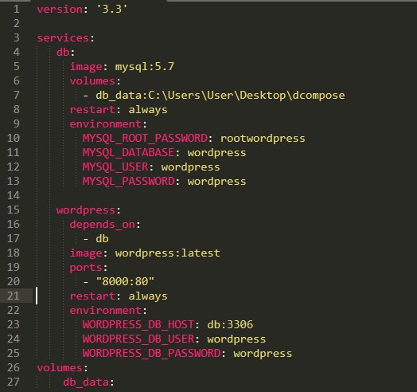
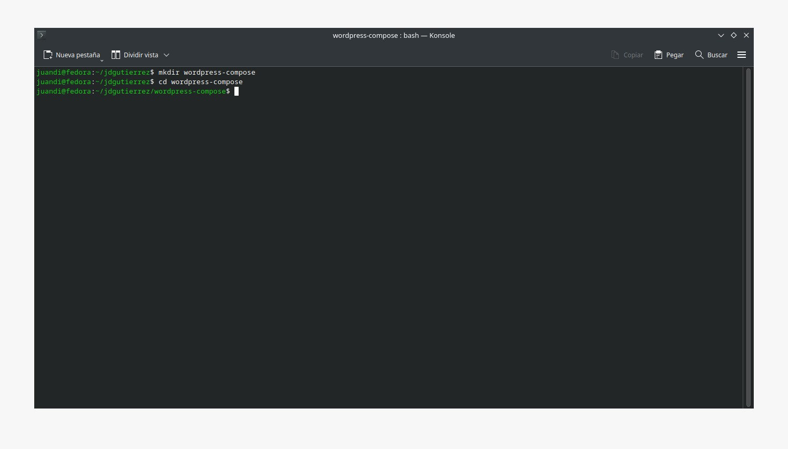
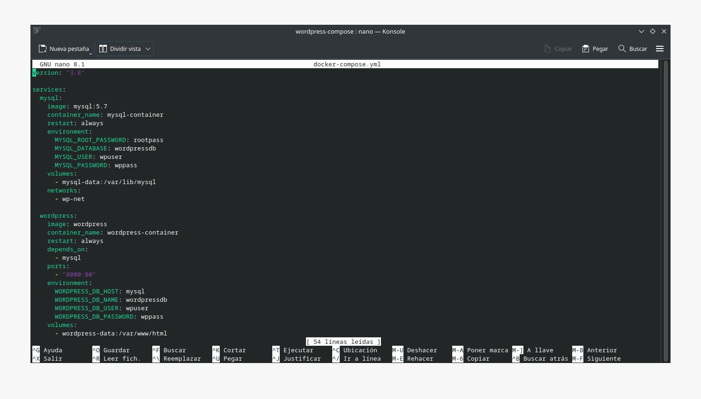
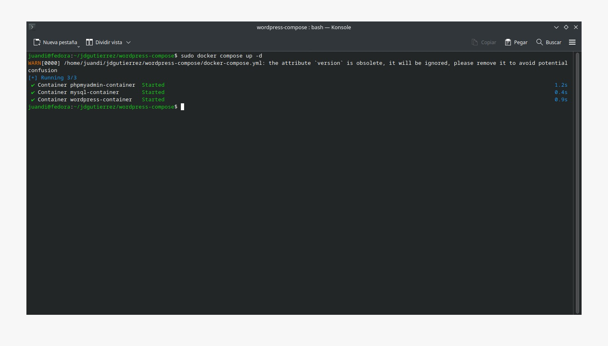
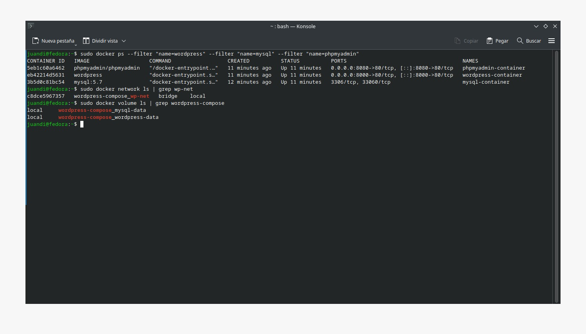

# Práctica Semana 6
## 1. Titulo
Despliegue de un sitio WordPress utilizando Docker Compose con servicios interconectados y volúmenes persistentes
## 2. Tiempo de duración
2 horas
## 3. Fundamentos:

Hoy en día, el despliegue de aplicaciones web se ve beneficiado por herramientas de contenedorización como Docker, que permiten empaquetar aplicaciones junto con sus dependencias en entornos aislados, portables y reproducibles. Según Docker (2024), esta tecnología asegura que las aplicaciones funcionen de manera consistente en diversos entornos, desde desarrollo hasta producción.

El archivo YAML (Yet Another Markup Language) es un formato de serialización de datos legible para humanos, comúnmente usado para definir configuraciones de forma estructurada. En el contexto de Docker, este formato se utiliza para describir múltiples servicios en un solo archivo docker-compose.yml. La clave de YAML es su estructura basada en identación, lo que facilita leer jerarquías y relaciones entre elementos como servicios, redes y volúmenes (O'Hara, 2021). Docker Compose aprovecha este formato para automatizar la creación y gestión de entornos multi-contenedor con simples comandos como docker compose up, sin necesidad de múltiples líneas en la terminal para cada servicio.

Durante la práctica, se implementaron contenedores individuales para tres componentes principales: WordPress, MySQL y phpMyAdmin. Cada contenedor ejecuta un servicio específico, facilitando el mantenimiento, escalabilidad y el aislamiento de errores. La configuración se realizó mediante comandos directos, sin utilizar herramientas adicionales como Docker Compose.

La red personalizada (docker network create) permite que los contenedores se comuniquen de forma segura mediante nombres de host en lugar de direcciones IP, lo que facilita la configuración de los servicios (Martínez, 2021). Esta red asegura que solo los contenedores autorizados puedan comunicarse entre sí, mejorando la seguridad del entorno.

Otro punto clave fue la utilización de volúmenes persistentes (docker volume create) para almacenar los datos de WordPress y MySQL, lo que garantiza que la información no se pierda al reiniciar o eliminar contenedores (Fernández, 2022).

Asimismo, se utilizaron variables de entorno al momento de crear los contenedores, permitiendo configurar parámetros esenciales como usuario, contraseña y nombre de la base de datos sin modificar manualmente los archivos de configuración (phpMyAdmin, 2024).

  

#### Figura 1 - Ejemplo de archivo .yml

## 4. Conocimientos previos.

Para realizar esta practica el estudiante necesita tener claro los siguientes temas:

-Comandos Linux básicos
-Uso de terminal
-Conceptos de base de datos relacionales
-Fundamentos de Docker
-Uso de archivos YAML

## 5. Objetivos a alcanzar

-Implementar contenedores para WordPress, MySQL y phpMyAdmin
-Configurar una red personalizada en Docker
-Establecer conexión entre contenedores usando nombres
-Establecer variables de entorno en la creación de contenedores
-Crear volúmenes para persistencia de datos

## 6. Equipo necesario:

- Computador con sistema operativo Windows (Virtual Machine) ó Linux (Nativo)
- Docker instalado 
- Conexión a Internet

## 7. Material de apoyo.

- Video explicativo SGA Semana 6
- Documentación oficial de Docker

## 8. Procedimiento

Paso 1: Crear directorio en donde se va a almacenar nuestro proyecto y entrar dentro del mismo.

  

#### Figura 2-Creación de directorio

Paso 2: Crear archivo .yml con touch y poner lo siguiente:

  

#### Figura 3-Configuración archivo .yml

Paso 3: Ejecutar el comando docker-compose up -d para iniciar los contenedores.

  

#### Figura 4-Creación de contenedores mediante el uso de comando docker-compose up -d

Paso 4: Verificar el estado de contenedores, red y volúmenes.

  

#### Figura 5-Verificar estado de lo creado

Paso 5: Verificar funcionamiento en la web.

  

#### Figura 5-Verificar funcionamiento de en la web

## 9. Conclusión:

- Esta práctica permitió implementar un entorno completo para WordPress con servicios acoplados mediante Docker Compose, facilitando el manejo de configuración, redes y almacenamiento. El uso del archivo docker-compose.yml simplifica la replicabilidad y mantenimiento del proyecto. Se afianzaron conocimientos sobre estructuras YAML, redes internas de Docker y almacenamiento persistente, brindando experiencia útil para proyectos de desarrollo web profesional.

## 10. Bibliografía

Docker. (2024). ¿Qué es Docker Compose? Recuperado de: https://docs.docker.com/compose/

phpMyAdmin. (2024). Documentación oficial. Recuperado de: https://docs.phpmyadmin.net/es/latest/

O'Hara, J. (2021). YAML: Guía práctica para desarrolladores. OpenDev Press.

Martínez, L. (2021). Introducción a Docker y contenedores. Recuperado de https://desarrolloweb.com/articulos/introduccion-docker-contenedores.html