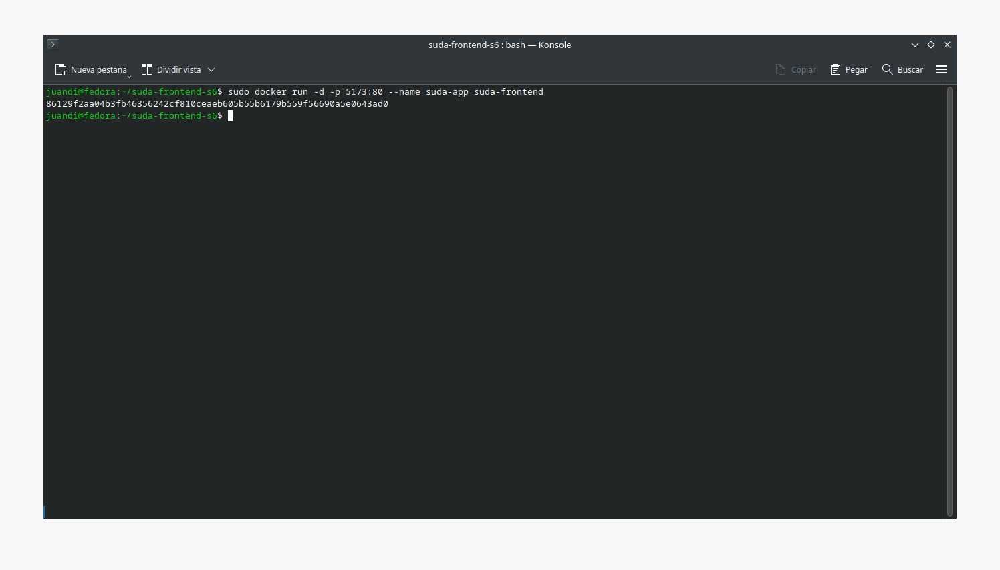

# Práctica Semana 7
## 1. Titulo
Contenerización de una aplicación React utilizando Docker a partir de un repositorio público
## 2. Tiempo de duración
2 horas
## 3. Fundamentos:

Docker es una herramienta de contenerización que permite empaquetar aplicaciones y sus dependencias en un contenedor estandarizado que puede ejecutarse de forma consistente en distintos entornos (Docker, 2024). Esto facilita el despliegue y la portabilidad del software sin preocuparse por conflictos de versiones o configuraciones.

En esta práctica se utilizó Docker para contenerizar una aplicación frontend desarrollada con React. React es una biblioteca de JavaScript que permite construir interfaces de usuario interactivas y eficientes (Facebook, 2024). El objetivo fue crear una imagen Docker a partir del código fuente de la aplicación React ubicado en el repositorio público:

https://github.com/Daviddotcoms/suda-frontend-s6

Adicionalmente, para que el frontend funcione correctamente, se requiere simular un backend con el repositorio mockAPI, disponible en:

https://github.com/Daviddotcoms/mockAPI

  

#### Figura 1 - Ejemplo de archivo .yml

## 4. Conocimientos previos.

Para realizar esta practica el estudiante necesita tener claro los siguientes temas:

-Comandos Linux básicos
-Uso de terminal
-Fundamentos de Docker

## 5. Objetivos a alcanzar

-Clonar y ejecutar localmente una aplicación React
-Crear un archivo Dockerfile para contenerizar la aplicación
-Construir una imagen Docker funcional
-Ejecutar el contenedor de la aplicación
-Simular un backend con mockAPI para probar el funcionamiento completo del frontend

## 6. Equipo necesario:

- Computador con sistema operativo Windows (Virtual Machine) ó Linux (Nativo)
- Docker instalado 
- Conexión a Internet

## 7. Material de apoyo.

- Video explicativo SGA Semana 7

## 8. Procedimiento

Paso 1: Clonar los repositorios

  

#### Figura 1-Clonar repositorios

Paso 2: Verificar el funcionamiento local frontend

  

#### Figura 2-Verificar funcionamiento frontend

Paso 3: Verificar el funcionamiento local backend

  

#### Figura 3-Verificar funcionamiento backend

Paso 4: Crear archivo Dockerfile

  

#### Figura 4-Archivo Dockerfile

Paso 5: Crear archivo nginx.conf

  

#### Figura 5-Archivo nginx.conf

Paso 6: Crear imagen Docker

  

#### Figura 6-Imagen Docker

Paso 7: Crear y correr contenedor

  

#### Figura 6-Contenedor Docker

Paso 8: Verificar funcionamiento

  

#### Figura 6-Funcionamiento correcto

## 9. Conclusión:

Esta práctica permitió reforzar el proceso de contenerización de una aplicación moderna desarrollada en React. Se logró construir una imagen Docker funcional, capaz de servir el frontend de forma independiente. El uso de serve permitió alojar la aplicación desde el contenedor como si fuera un entorno de producción.

Además, se comprendió la importancia de tener los servicios backend y frontend sincronizados, especialmente cuando se trabaja en entornos de desarrollo local o despliegues reales. Se destacó la utilidad del Dockerfile como herramienta clave para empaquetar y distribuir aplicaciones web.

## 10. Bibliografía

Docker. (2024). ¿Qué es Docker? Recuperado de: https://docs.docker.com/

Facebook. (2024). React – A JavaScript library for building user interfaces. Recuperado de: https://reactjs.org

Daviddotcoms. (2024). Repositorio suda-frontend-s6. GitHub. https://github.com/Daviddotcoms/suda-frontend-s6

Daviddotcoms. (2024). Repositorio mockAPI. GitHub. https://github.com/Daviddotcoms/mockAPI