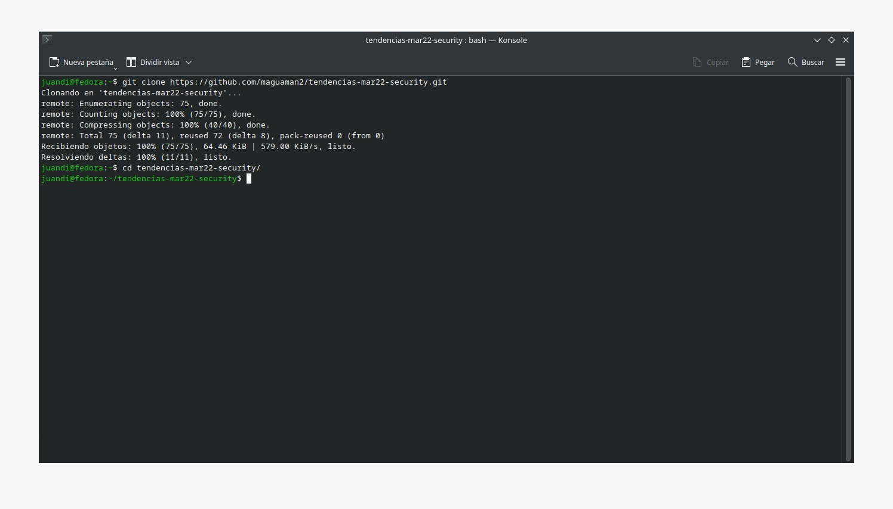
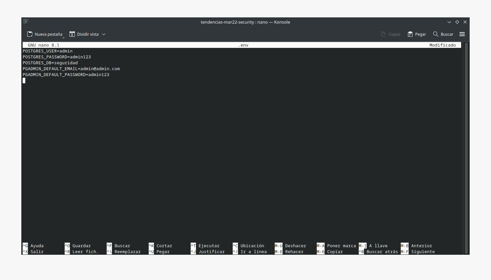
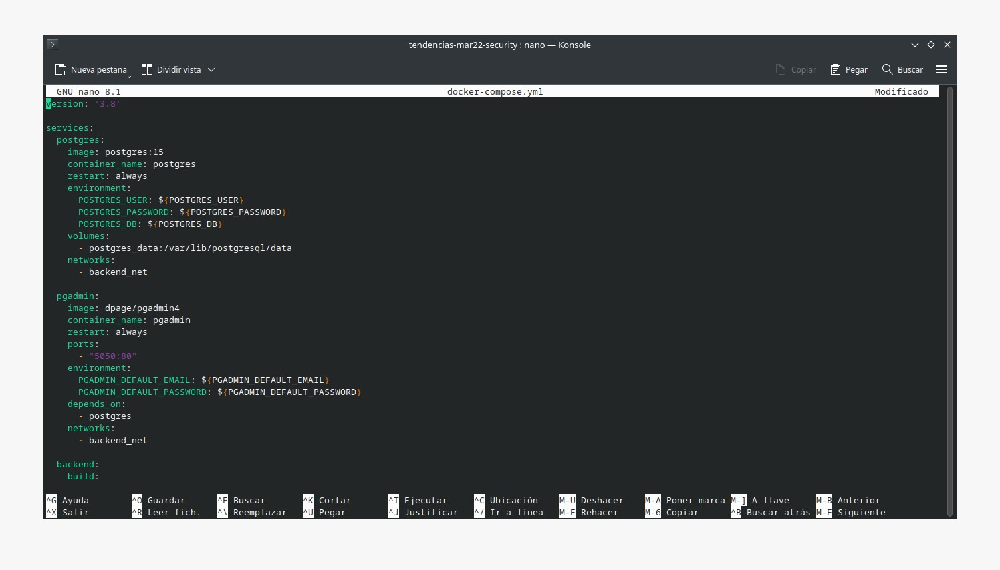
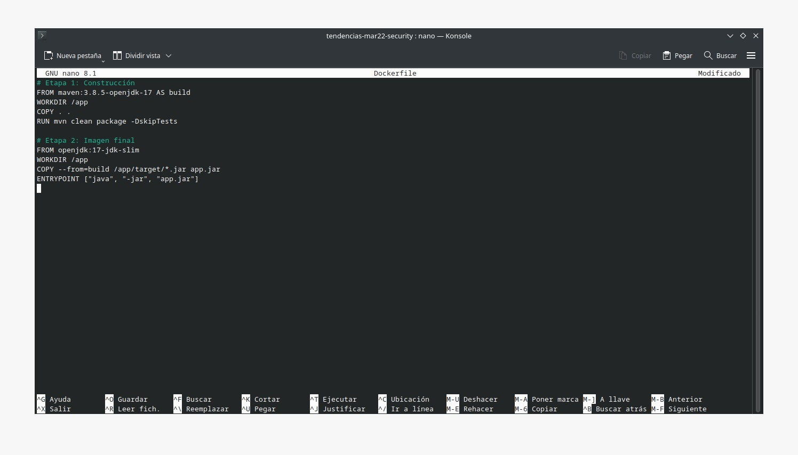
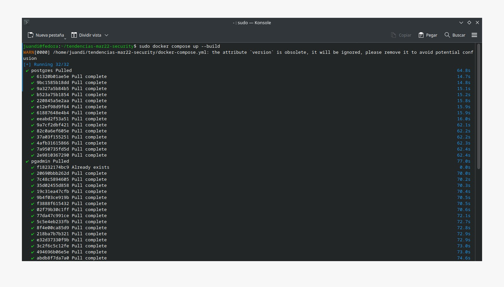
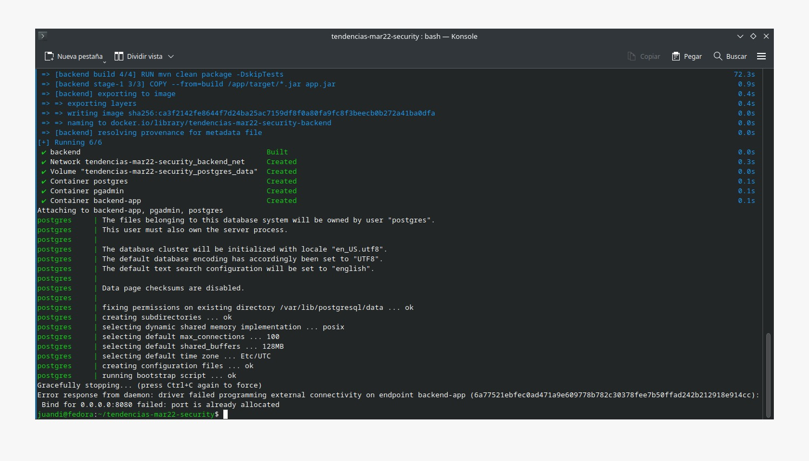
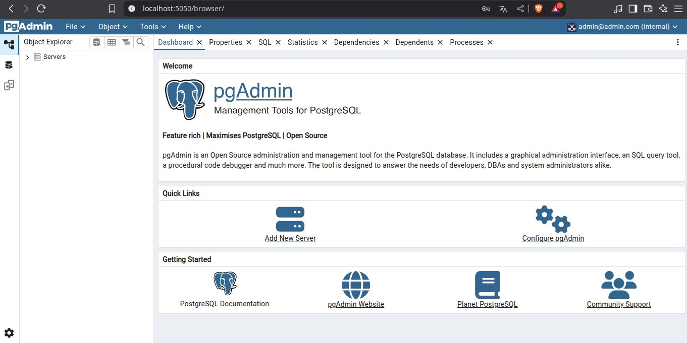

# Práctica Semana 8

## 1. Título

Contenerización de una aplicación Java y configuración de servicios PostgreSQL y pgAdmin con Docker Compose

## 2. Tiempo de duración

2 horas

## 3. Fundamentos:

Docker es una plataforma de virtualización ligera que permite empaquetar una aplicación y sus dependencias en contenedores, haciendo posible su ejecución uniforme en cualquier entorno (Docker, 2024). Su uso se ha convertido en una práctica esencial en el desarrollo moderno por su eficiencia, portabilidad y facilidad de automatización.

En esta práctica se trabajó con una arquitectura compuesta por una aplicación backend desarrollada en Java y una base de datos PostgreSQL, administrada mediante la interfaz pgAdmin. Se utilizaron técnicas de construcción multietapa (multi-stage builds) para optimizar la generación de la imagen de Docker de la aplicación, logrando reducir significativamente su tamaño final y separando las etapas de compilación y ejecución (Oracle, 2024).

Se creó un archivo docker-compose.yml para levantar simultáneamente los servicios necesarios: PostgreSQL, pgAdmin y el backend Java. Se configuraron redes personalizadas y volúmenes para asegurar la persistencia de datos y la conectividad entre contenedores. Adicionalmente, se definió un archivo .env para gestionar las variables de entorno de forma centralizada y segura (PostgreSQL Global Development Group, 2024; Dpage, 2024).

El objetivo final fue levantar un entorno completo de desarrollo que simula un entorno de producción a nivel local, fomentando buenas prácticas de despliegue y automatización.

## 4. Conocimientos previos.

* Comandos básicos de Linux
* Fundamentos de Java
* Fundamentos de PostgreSQL
* Uso básico de Docker y Docker Compose
* Concepto de redes y volúmenes en Docker

## 5. Objetivos a alcanzar

* Configurar PostgreSQL y pgAdmin con Docker Compose
* Crear redes y volúmenes personalizados
* Construir la imagen de una aplicación Java utilizando multi-stage build
* Ejecutar la aplicación en un contenedor y conectar con PostgreSQL
* Utilizar un archivo .env para configurar variables de entorno

## 6. Equipo necesario:

* Computador con sistema operativo Windows (Virtual Machine) ó Linux (Nativo)
* Docker instalado
* Conexión a Internet

## 7. Material de apoyo.

* Video explicativo SGA Semana 8

## 8. Procedimiento

### Paso 1: Clonar el repositorio de la aplicación backend

Se descargó el código fuente de la aplicación Java desde el repositorio público proporcionado y se accedió a la carpeta del proyecto.

  

#### Figura 1 - Clonar repositorio

### Paso 2: Crear el archivo Dockerfile (multi-stage)

Se creó un archivo Dockerfile con configuración de múltiples etapas para construir la aplicación Java y luego empaquetarla con una imagen ligera.

  

#### Figura 2 - Dockerfile multi-stage

### Paso 3: Crear el archivo docker-compose.yml

Se definieron los servicios de PostgreSQL, pgAdmin y la aplicación backend en un archivo docker-compose.yml, estableciendo redes y volúmenes personalizados para garantizar la comunicación entre servicios y la persistencia de datos.

  

#### Figura 3 - docker-compose.yml

### Paso 4: Crear archivo .env

Se configuró un archivo .env con las variables necesarias para los servicios, permitiendo una configuración más flexible y segura.

  

#### Figura 4 - Archivo .env

### Paso 5: Levantar los servicios

Se construyó la imagen de la aplicación y se levantaron todos los servicios definidos en el docker-compose.yml, incluyendo la base de datos y el administrador pgAdmin.

  

#### Figura 5 - Levantar servicios

### Paso 6: Verificar backend en el navegador

Se comprobó que el backend estuviera corriendo correctamente accediendo desde el navegador a `http://localhost:8080`.

  

#### Figura 6 - Backend en ejecución

### Paso 7: Verificar pgAdmin en el navegador

Se accedió a `http://localhost:5050` para confirmar que la interfaz de pgAdmin estuviera disponible y funcional, permitiendo conectarse a la base de datos configurada.

  

#### Figura 7 - Acceso a pgAdmin

## 9. Conclusión:

Esta práctica permitió construir un entorno completo de desarrollo con servicios reales. Se aplicaron buenas prácticas de contenerización utilizando `Dockerfile` con técnica multietapa para optimizar la imagen de la aplicación Java. También se configuró PostgreSQL y pgAdmin para una administración visual de la base de datos.

Se destacó el uso de `docker-compose` como herramienta clave para orquestar múltiples servicios, facilitar la gestión de entornos locales y establecer conectividad entre contenedores mediante redes personalizadas. El uso de un archivo `.env` mejora la seguridad y mantenibilidad del proyecto al centralizar las configuraciones sensibles.

## 10. Bibliografía

Docker. (2024). ¿Qué es Docker? Recuperado de: [https://docs.docker.com/](https://docs.docker.com/)

Apache Maven. (2024). Introduction to the POM. Recuperado de: [https://maven.apache.org/pom.html](https://maven.apache.org/pom.html)

PostgreSQL Global Development Group. (2024). PostgreSQL Documentation. Recuperado de: [https://www.postgresql.org/docs/](https://www.postgresql.org/docs/)

Dpage. (2024). pgAdmin4 Docker Image. Recuperado de: [https://hub.docker.com/r/dpage/pgadmin4/](https://hub.docker.com/r/dpage/pgadmin4/)

Oracle. (2024). Java Documentation. Recuperado de: [https://docs.oracle.com/javase/](https://docs.oracle.com/javase/)

