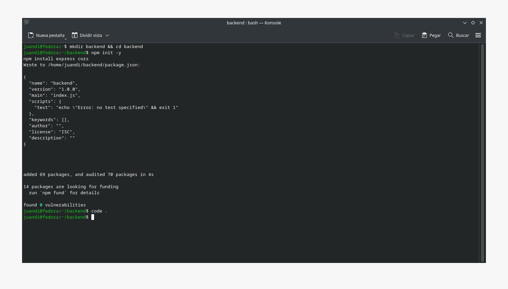
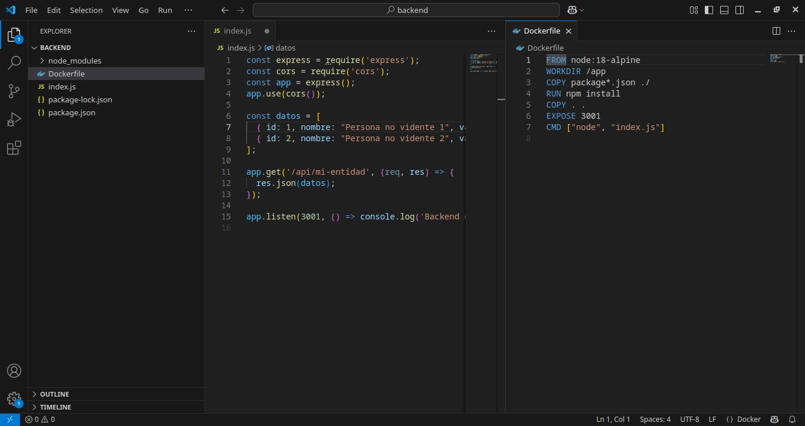
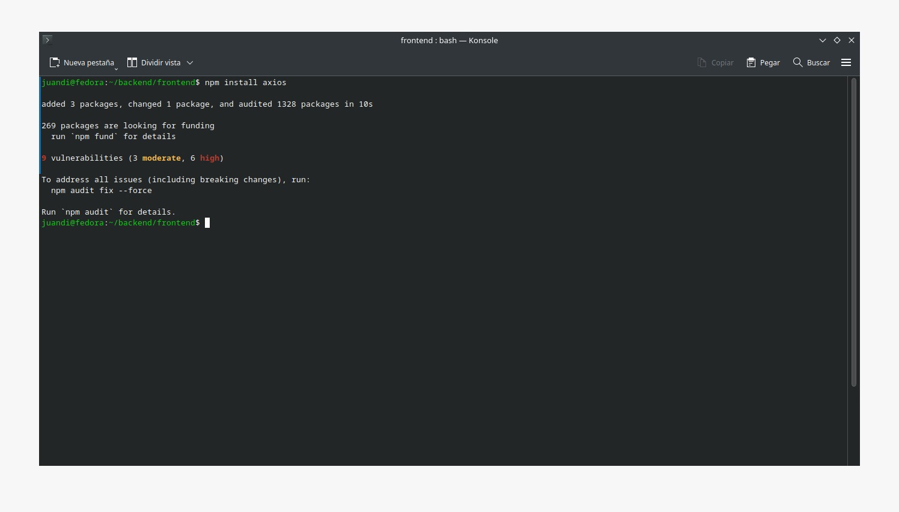
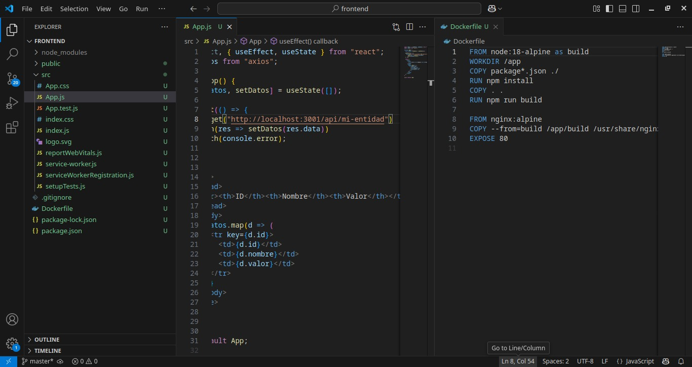
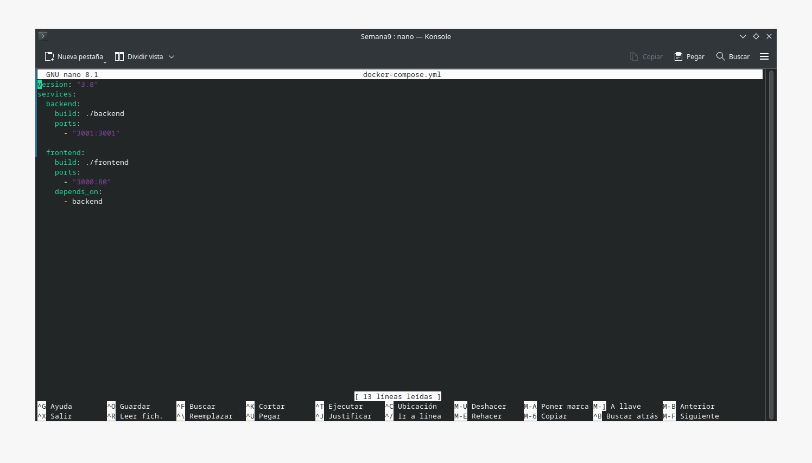
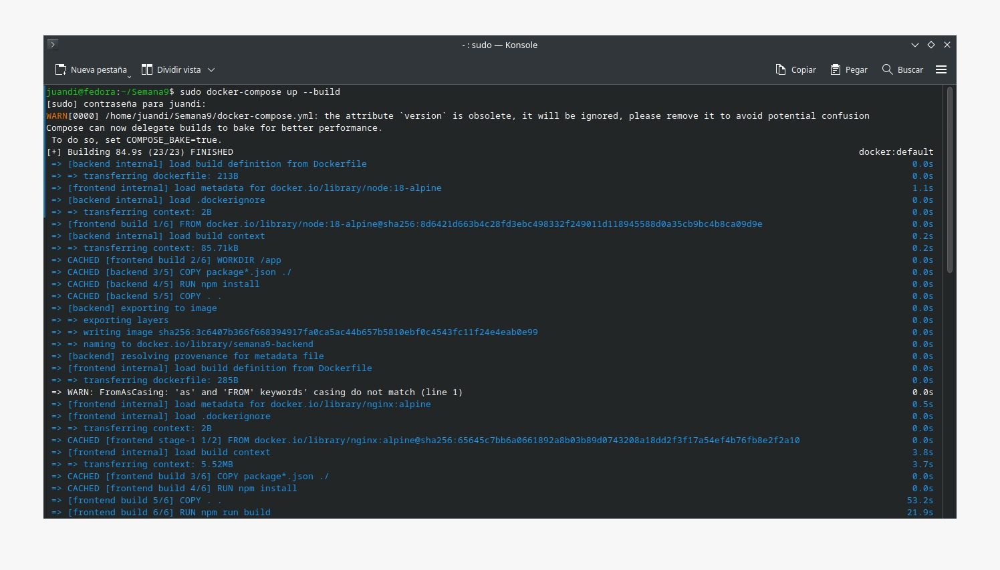
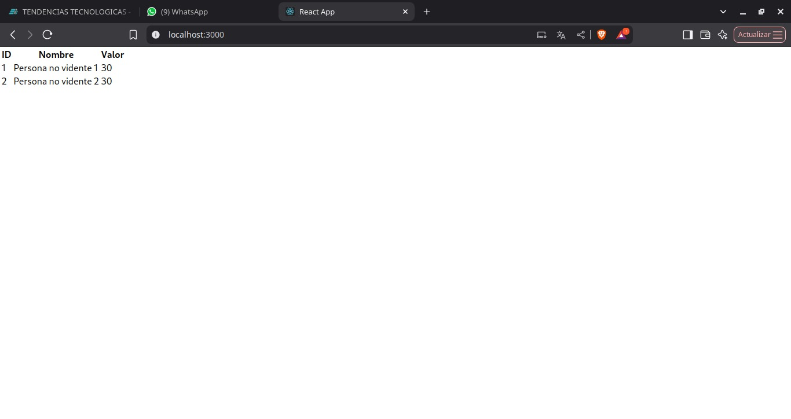

# Práctica Semana 9

## 1. Título

Contenerización de una aplicación React que consume datos de una API REST con Docker Compose

## 2. Tiempo de duración

2 horas

## 3. Fundamentos

Docker permite aislar aplicaciones en contenedores ligeros que incluyen todo lo necesario para su ejecución. En esta práctica se desarrolló una arquitectura basada en dos contenedores: un frontend en React y un backend en Node.js con Express, los cuales se comunican mediante una red definida en Docker Compose.

El frontend muestra una tabla con los datos obtenidos desde el backend, y ambos servicios fueron contenerizados con archivos `Dockerfile` individuales. Se utilizó `docker-compose.yml` para facilitar el levantamiento simultáneo de ambos proyectos y su correcta conexión.

Esta práctica replica un entorno real de desarrollo en microservicios, fomentando el uso de buenas prácticas en la creación, despliegue y comunicación entre aplicaciones contenerizadas (Docker, 2024).

## 4. Conocimientos previos

- Fundamentos de React
- Fundamentos de Node.js y Express
- Comandos básicos de Docker
- Concepto de contenedores y redes
- Uso de `docker-compose`

## 5. Objetivos a alcanzar

- Implementar una API REST simple en Express
- Crear un frontend React que consuma dicha API
- Construir imágenes de Docker para ambos servicios
- Utilizar Docker Compose para orquestar la arquitectura
- Visualizar datos desde el navegador

## 6. Equipo necesario

- Computadora con Fedora Linux
- Docker y Docker Compose instalados
- Acceso a terminal y editor de texto

## 7. Material de apoyo

- Video tutorial SGA Semana 9

## 8. Procedimiento

### Paso 1: Crear estructura de carpetas

Se creó la carpeta del backend dentro de una carpeta principal (Semana9) y se instaló Express

  

#### Figura 1 - Creación de directorio e instalación de express

---

### Paso 2: Implementar lógica backend

Se implementó la lógica de la API REST en el archivo `index.js` del backend, devolviendo un arreglo de datos simulados. Además, se configuró un archivo Dockerfile

  

#### Figura 2 - Código de `index.js` y `Dockerfile` listos

---

### Paso 3: Crear directorio frontend con react e instalación de axios

Se creó una app react para el frontend y se instaló axios

  

#### Figura 3 - Directorio frotend e instalación axios

---

### Paso 4: Implementar lógica frontend

Se creó la lógica para al app react y para el archivo `Dockerfile`

  

#### Figura 4 - Lógica frontend

---

### Paso 5: Creación archivo .yml

Se creó un archivo `docker-compose.yml` dentro del directorio principal de donde se aloja el backend y el frontend

  

#### Figura 5 - Configuración archivo `docker-compose.yml`

---

### Paso 6: Ejecutar comando `docker-compose up --build`

Se ejecutó el comando `docker-compose up --build`

  

#### Figura 6 - Ejecución de comando `docker-compose up --build`

---

### Paso 7: Verificar funcionamiento en el navegador

Se accedió a `http://localhost:3000` para confirmar que el frontend mostrara correctamente los datos obtenidos desde la API REST alojada en el contenedor backend.

  

#### Figura 7 - Tabla con datos mostrada correctamente desde el navegador

---

## 9. Conclusión

Esta práctica permitió simular una arquitectura real de frontend y backend contenerizados. Se aplicaron buenas prácticas de separación de servicios, construcción de imágenes livianas y uso de Docker Compose para orquestación.

Además de aprender a contenerizar proyectos con React y Node.js, se comprendió cómo funciona la red interna de Docker y cómo conectar múltiples contenedores en un solo entorno de trabajo controlado y reproducible.

## 10. Bibliografía

Docker. (2024). ¿Qué es Docker? Recuperado de: [https://docs.docker.com/](https://docs.docker.com/)

React. (2024). React documentation. Recuperado de: [https://react.dev/](https://react.dev/)

Node.js. (2024). Node.js documentation. Recuperado de: [https://nodejs.org/](https://nodejs.org/)

Express. (2024). Express documentation. Recuperado de: [https://expressjs.com/](https://expressjs.com/)

Compose. (2024). Docker Compose overview. Recuperado de: [https://docs.docker.com/compose/](https://docs.docker.com/compose/)
